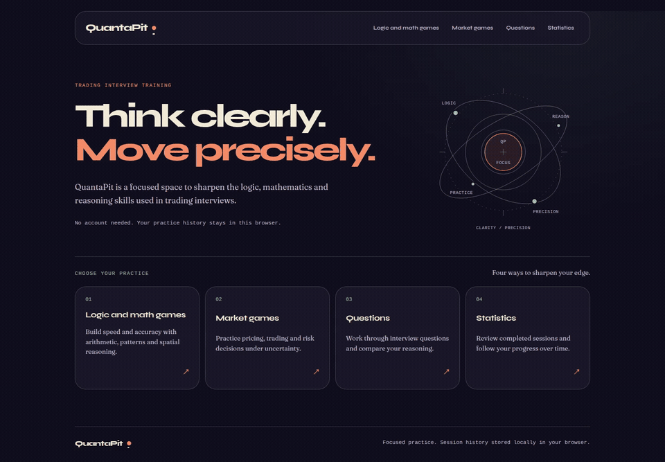

# QuantaPit

QuantaPit is a **local-first quantitative and market interview training platform** built with React, TypeScript, Vite, IndexedDB, and Vitest.

[](./assets/quantapit-demo.mp4)

**See it in action:** a walkthrough of the plum-coloured home with animated orbits and botanical side ornaments, the game catalogues, a correct Quick Math answer, a profitable Venue Gap trade, an interview question with its answer, and saved-session charts and details. Recorded from the production build at the enlarged default interface scale; all interactions and results come from the running application.

[View or download the full-resolution video (MP4)](./assets/quantapit-demo.mp4).

It provides short practice sessions for quantitative reasoning, logic, memory, visual reasoning, market making, arbitrage, portfolio hedging, and open-ended interview questions. Completed sessions are stored locally in the browser and exposed through per-game performance statistics.

> **Early-stage notice:** This is the very first version and the first project phase. It is a working prototype, not a production-ready product. There are still many rough edges, incomplete areas, and known issues.

## Features

- Logic and quantitative games:
  - Quick Math
  - Sequences
  - Radix Rush
  - Tape Recall
  - FoldSight
  - Magnitude Forge
- Market games:
  - Hidden Spread
  - Basket Edge
  - Venue Gap
  - Delta Shield
- Open-ended interview question practice
- Local session persistence with IndexedDB
- Portable local JSON export and import of completed session history
- Compact per-game charts: accuracy for answer-based games, score for Magnitude Forge and Delta Shield, and P&L for trading games
- Last-five trend medians and ten-session comparisons
- Expandable session details with response time, completion, duration, and secondary accuracy where recorded
- Consecutive-day activity streak
- Responsive desktop and mobile UI
- Custom session durations, question targets, and round clocks with validated game-specific limits
- No account, backend, cloud storage, telemetry, or external runtime service

## Design continuity

QuantaPit continues the visual language of `giacomo-portfolio` with its own palette: a dark plum canvas (`#24182f`), warm ivory text (`#fff1dd`), peach actions (`#f4b183`), sage accents (`#a5cdb0`), lavender details, and rounded panels. Botanical engravings, contour lines, and small celestial details enrich the page edges without intercepting input; they are quieter during games. Syne headings and Fraunces reading text are self-hosted; arithmetic, quotes, clocks, and performance data retain monospaced numerals. No external font service is used.

The redesign covers navigation, catalogues, every game's setup/live/results screens, interview practice, statistics, and local-history transfer. Existing routes, rules, timers, configurable limits, scoring, and IndexedDB records are unchanged. Positive and negative feedback stay visually distinct; keyboard focus, disabled states, and reduced-motion preferences are supported.

The home illustration is decorative and has no labels. Its bodies travel along their elliptical tracks using CSS motion paths at different speeds, without a JavaScript animation loop. Reduced-motion preferences stop the bodies at distinct positions.

The interface has a **110% base scale** using CSS `zoom: 1.1`: browser zoom remains user-controlled, while the previous 110% presentation becomes the new default at browser 100%. Responsive breakpoints are scaled to match, so mobile controls continue to reflow rather than being cropped.

Refinement verification: a successful TypeScript/Vite production build and real Chromium sessions completing all ten games plus interview practice at 320px, including all five Hidden Spread roles. Statistics survived a reload. Home layouts were checked at 320, 390, 528, 768, 880, 980, 1280, 1440, and 1920px; Hard live screens were checked at 320 and 1440px, with no horizontal page overflow or clipped controls in those scenarios. Orbit positions changed over time and stayed fixed with reduced motion. The mobile FoldSight net uses its natural height so all faces remain separate from the answer cubes.

Bundled Syne and Fraunces fonts are licensed under the SIL Open Font License 1.1; their copyright notices and full licenses are included in [`public/fonts/Syne-OFL.txt`](./public/fonts/Syne-OFL.txt) and [`public/fonts/Fraunces-OFL.txt`](./public/fonts/Fraunces-OFL.txt).

## Technology

- React
- TypeScript
- Vite
- React Router
- IndexedDB
- Vitest
- jsdom
- fake-indexeddb for persistence tests

## Getting started

### Requirements

Use **Node.js 24 LTS, version 24.15.0 or newer**, with npm. The locked dependencies also support Node.js 22.22.2+ on the 22.x line, or Node.js 26+. Older Node.js versions do not satisfy the test environment's requirements.

The `.nvmrc` file selects Node.js 24. If you use [nvm](https://github.com/nvm-sh/nvm#installing-and-updating), run `nvm install` and `nvm use` from the repository root before installing dependencies.

### Install dependencies

```bash
npm ci
```

### Start the development server

```bash
npm run dev
```

Open the local URL printed by Vite, usually `http://localhost:5173`.

### Ubuntu / Linux

QuantaPit runs as a local web application, not a native desktop executable. It needs Node.js/npm for the server and a modern browser with IndexedDB enabled; no backend service or OS-specific setup is required.

With Node.js 24 LTS and npm installed, run from the repository root:

```bash
node --version
npm --version
npm ci
npm run dev
```

Open the URL printed by Vite in Firefox, usually `http://localhost:5173`. Keep the terminal running; press `Ctrl+C` to stop the server. Do not open `index.html` directly using `file://`, and do not run npm with `sudo`.

Compatibility was verified for [issue #10](https://github.com/ManfuG/QuantaPit/issues/10) on **Ubuntu 26.04.1 LTS x64**, with **Node.js 24.21.0**, **npm 11.19.0**, and **Firefox 156.0.1**:

- Clean dependency installation using `npm ci`.
- The full Vitest suite and the TypeScript/Vite production build.
- The development server and production preview in Firefox, including client-side navigation.
- A completed Quick Math session, IndexedDB persistence, and statistics still visible after reloading.

No Linux-specific application defect was found in these checks. Other Linux distributions, architectures, and browsers were not exercised in this verification.

### Run tests

```bash
npm test -- --run
```

### Create a production build

```bash
npm run build
```

### Preview the production build

```bash
npm run preview
```

## Main routes

- `/` — Home
- `/logic-and-math-games` — Logic and quantitative games
- `/market-games` — Market games
- `/open-questions` — Interview question practice
- `/statistics` — Local performance overview and activity streak
- `/statistics/:gameId` — Per-game performance detail

### Configuring practice

Presets remain available alongside custom inputs, with aligned fields on desktop and stacked controls on mobile. FoldSight's question target is directly editable without an extra toggle.

| Games | Custom settings | Default |
| --- | --- | --- |
| Quick Math, Sequences, Radix Rush, Tape Recall | Duration in minutes (fractions allowed), positive whole-number question target | 1 minute, 10 questions, Medium |
| FoldSight | Duration in minutes (fractions allowed), positive whole-number question target | 1 minute, 10 questions |
| Magnitude Forge | Distinct questions up to the available bank, whole seconds per question | 5 questions, 60 seconds each |
| Basket Edge, Venue Gap, Delta Shield | Positive whole-number rounds and seconds per round | 5 rounds, 60 seconds each, Easy |
| Hidden Spread | Positive whole-number rounds, seconds to trade, seconds to quote | 5 rounds, 60 seconds to trade, 30 to quote, Easy |

Timed drills stop at the first limit reached; Tape Recall includes memorization in the session clock. Durations must be at least one second (`0.5` minutes means 30 seconds). Per-question and per-round clocks reset for each item. Hidden Spread repeats its shuffled five-player quoting order every five rounds, so shorter sessions can omit some roles. Generated drills create questions as needed rather than allocating the entire target at startup.

Counts and clocks must stay within JavaScript's safe numeric range; round-count/time combinations that exceed safe total milliseconds are rejected. Invalid inputs show the field and allowed range without starting an attempt. Results show the selected configuration; local records retain planned targets, clocks, and actual completion. Existing session records remain readable.

Interview question practice remains untimed, with its existing count bounded by the selected category/difficulty bank.

### Reading game statistics

Use the Easy, Medium, and Hard buttons to switch between difficulty-specific charts, summaries, and history. Each view shows its latest twenty sessions: connected points run oldest to newest, while expandable history runs newest first. The latest session's difficulty is selected initially. FoldSight and Magnitude Forge have no difficulty levels and keep a single view; legacy sessions without a difficulty remain accessible under Unspecified.

Accuracy and score use fixed 0–100 scales; P&L includes a zero baseline and preserves losses. Missing measurements leave gaps in the line rather than estimated values. A single session has no comparison; small samples are labelled as initial. Trends retain their last-five median windows and never combine games or difficulty levels in game detail. Completion is recorded items divided by the planned target, including skipped and timed-out rounds; sessions without an item target show `N/D`.

## Local data and privacy

QuantaPit is designed to run locally. Completed sessions and session items are stored in the browser's IndexedDB database named `quantapit-performance`.

The application does not require an account or a remote API. Local browser data is not synchronized between devices. Clearing browser storage removes the locally stored sessions.

Do not commit credentials, `.env` files, browser exports, or private notes. Personal project notes are intentionally excluded from the repository through `.gitignore`.

### Exporting and importing performance history

Open **Statistics** and use **Export sessions** to download a JSON backup. Export includes all completed sessions and their granular session items, even beyond the latest twenty shown in each game chart. Empty history produces a valid empty backup. Active/abandoned attempts and browser preferences are not exported.

On another browser or device, open QuantaPit → **Statistics** → **Import sessions** and select the backup file. No account, upload, or server request is involved. The overview refreshes after a successful import and reports imported sessions and skipped duplicates.

Imports are additive and atomic:

- New session IDs are added with their items and completed attempt markers.
- Identical session IDs already stored or repeated in the file are skipped. Object-key order, item-array order, and JSON-omitted optional properties do not create conflicts.
- A session ID with different content rejects the entire file. Existing sessions are never replaced.
- IDs colliding with active/abandoned attempts or orphaned stored items also reject the entire file.
- Malformed JSON, unsupported versions/games, invalid field types, invalid configurations, mismatched item references/counts, and duplicate item indexes are rejected before storage changes.
- Storage write failures roll back the whole import. Export refuses invalid local records rather than silently omitting them.

#### Backup format, version 1

```json
{
  "format": "quantapit-performance",
  "version": 1,
  "exportedAt": "2026-10-01T00:00:00.000Z",
  "sessions": []
}
```

`exportedAt` is an ISO 8601 timestamp. Each `sessions` entry contains `{ "session": <SessionResult>, "items": <SessionItem[]> }`, using the existing performance schema:

- `session` has `schemaVersion: 1`, a nonempty `sessionId`, a supported `gameId`, ISO start/completion timestamps, `status: "completed"`, a termination reason, configuration, duration/count metadata, and a summary. Optional difficulty, mode, planned limits, and score are preserved.
- Each item has `payloadVersion: 1`, the same session/game IDs, a unique nonnegative `index`, a terminal item status, and its game-specific JSON `payload`. Optional outcome, timestamps, and response time are preserved.
- All recorded question/round data, answers, trading decisions, and metrics remain in their original payloads. Files with unknown backup, session, or payload versions are not imported.

The backup version is independent of the IndexedDB database version. The existing database and stores are unchanged. Legacy local sessions already supported by the repository are normalized to the current session schema when exported.

Keep backup files private: they contain your complete exported practice history. Clearing browser storage still removes local history; restore it by importing a previously exported file.


## Development workflow

The project was developed through an iterative, agent-assisted **vibe coding** workflow. OpenAI Codex, running through the Oh My Pi/AgenticOS harness, was used for conversational prototyping, code exploration, refactoring, test creation, documentation, and UI iteration.

Vibe coding accelerated the feedback loop, but changes were kept under human direction and checked with:

- focused and full Vitest runs;
- TypeScript and Vite production builds;
- browser-based smoke tests of the real application surface;
- repository and secret audits before publication.

## Current limitations

- The project is still an early prototype.
- The game catalogue and scoring rules may change substantially.
- Browser-local data has no automatic synchronization; backups must be exported manually.
- Some UI, accessibility, and responsive edge cases remain to be improved.
- Statistics are intentionally limited to locally completed sessions.
- There is no authentication, shared leaderboard, or server-side persistence.

## License

QuantaPit is released under the [MIT License](./LICENSE). You are free to use, copy, modify, merge, publish, distribute, sublicense, and sell copies of the software, provided that the copyright notice and license text are included in substantial portions of the software.

The software is provided "as is", without warranty of any kind. See [`LICENSE`](./LICENSE) for the complete terms.
